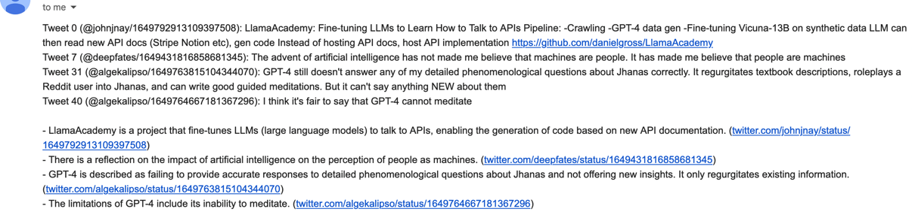

This project helps to keep up with recent news in AI, by emailing a summary of the AI tweets in your timeline. 

Instead of constantly checking twitter, which requires reading 
through unrelated tweets and also getting exposed to constant snark and dunking, we can use GPT to filter the timeline
and summarize the tweets.



## Setup
You need a create a top-level .env file to load in env vars, with the following fields. 
username and password for your twitter login, OpenAI API key, gmail login credentials for an account to send email with,
and the email account you want to receive the summary at.

Don't worry about loading the env vars, that gets taken care of in the code.

```
username=x
password=x
OPENAI_API_KEY=x
gmail_username=x
gmail_app_password=x
email_recipient=x
```

## Running locally

There's a Dockerfile for running with docker.

If you want to run the code directly, you need to first install the requirements in requirements.txt.

You can run the code with `python src/main.py`.

## Deployment
I've deployed this project to GCP, and am running it as a GCR job on a schedule.

If you want to do the same, you'll need to setup GCP properly. From there, the deploy script essentially looks like below.
You'll also need to manually specify the latest revision in GCP.

```
docker build -t twitter-summary . --platform=linux/amd64
docker tag twitter-summary:latest  gcr.io/twitter-summary/twitter-summary:latest
docker push gcr.io/twitter-summary/twitter-summary:latest
```